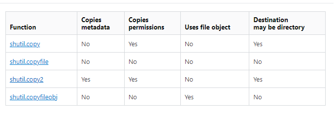

# 文件操作
---

+ ## 文字文件讀寫
  + ### 讀寫3步驟
    1. **開啟文件**
    2. **讀/寫動作**
    3. **關閉文件**
  + ### 語法
    ```
    文件寫出
    f = open(file_name, mode='w', encoding='utf-8')
    f.write(write_content)
    f.close()
    
    文件讀取
    f = open(file_name, mode='r', encoding='utf-8')
    file_content = f.read()
    f.close()
    ```
  + ### 模式
    1. **讀取**
       + **'r' 打開文件讀取(默認模式)**
    2. **寫出**
       + **'w' 打開文件寫入，若原本沒文件則會創立，若原本有文件則會覆蓋原本內容**
       + **'x' 創立新文件寫入，若原本位置已有文件，則會發生錯誤**
       + **'a' 打開文件寫入，若原本沒文件則會創立，若原本有文件則會在原本內容後面添加新內容**
    3. **文件內容**
       + **'b' 二進制用**
       + **'t' 文字類用(默認模式)**
    4. **更新**
       + **'+' 打開一個文件，更新其內容，可讀可寫**
    
  + ### 範例
    ```python
    # 文件寫出
    # f = open('tt.txt', mode='w',
    #  encoding='utf-8')  # 1.打開文件
    # f.write('疫苗快點打\n')   # 2.執行動作
    # f.wri
    # telines(['BNT\n', '莫德納\n', 'AZ\n', '嬌生'])  # writelines可以一次傳入多行資料
    # f.close()   # 3.關閉文件

    # 文件讀取
    # f = open('tt.txt', mode='r', encoding='utf-8')
    # print(f.read())
    # f.close()
    ```

+ ## 二進制文件讀寫
  + ### 範例
    ```python
    # 二進制寫出
    # f = open('tt.txt', mode='wb')
    # f.write(b'Hello')
    # f.close()

    # 二進制讀取
    # f = open('tt.txt', mode='rb')
    # print(f.read())
    # f.close()
    ```

+ ## 簡易寫法 
  + ### 語法
    ```
    with open(file_name, mode='w/r', encoding='utf-8') as f:
        f.write/read()
    ```

  + ### 範例
    ```python
    # 文件寫出
    # with open('tt.txt', mode='w', encoding='utf-8') as f:  
    #     f.write('疫苗快點打\n')   
    #     f.writelines(['BNT\n', '莫德納\n', 'AZ\n', '嬌生'])  

    # 文件讀取
    # with open('tt.txt', mode='r', encoding='utf-8') as f:
    #     print(f.read())

    """
    簡易寫法好處就是少寫一個f.close()，就是打開文件進行動作兩個步驟而已
    """
    ```

+ ## 文件其他常用操作
  + ### 獲取當前目錄
    ```
    方法1
    import os
    os.getcwd()

    方法2
    from pathlib import Path
    print(Path.cwd())   
    ```

  + ### 獲取目錄底下的所有資料夾與檔案
    ```
    方法1
    import os
    os.listdir(folder_path)

    方法2
    from pathlib import Path
    p = Path(folder_path)
    [file for file in p.glob('*')]
    ```

  + ### 獲取目錄及其所有子資料夾底下的所有檔案
    ```
    from pathlib import Path
    p = Path(folder_path)
    [str(file) for file in p.rglob('*')]
    ```

  + ### 判斷資料夾或檔案是否存在
    ```
    方法1
    import os
    os.path.exists(folder_path/file_path)
    
    方法2
    from pathlib import Path, PurePath
    Path(folder_path/file_path).exists()
    ```

  + ### 判斷是否為資料夾
    ```
    方法1
    import os
    os.path.isdir(folder_path/file_path)

    方法2
    from pathlib import Path
    Path(folder_path/file_path).is_dir()
    ```

  + ### 判斷是否為檔案
    ```
    方法1
    import os
    os.path.isfile(folder_path/file_path)

    方法2
    from pathlib import Path
    Path(folder_path/file_path).is_file()
    ```

  + ### 改變當前目錄
    ```
    import os
    os.chdir(folder_path)
    ```

  + ### 目錄拼接
    ```
    方法1
    import os
    os.path.join(folder_path, folder_path/file_path)

    方法2
    from pathlib import Path
    print(Path(folder_path) / folder_path/file_path)   
    ```

  + ### 創建新資料夾
    ```
    方法1
    import os
    os.makedirs(folder_path)

    方法2
    from pathlib import Path
    Path(folder_path).mkdir(parents=True)
    ```

  + ### 列出特定副檔名
    ```
    只單層資料夾
    方法1
    import os
    p = os.listdir(folder_path)
    [i for i in p if i.endswith('.Filename_Extension')]

    方法2
    from pathlib import Path
    p = Path(folder_path)
    [file for file in p.glob('*.Filename_Extension')]
    ```

  + ### 範例
    ```python
    import os
    from pathlib import Path

    """
    pathlib裡面的Path概念是直接把路徑當成一個物件來操作
    """

    p = Path.cwd()
    star = '*' * 40
    # 獲取當前目錄，感覺上兩種方法差不多
    # print(f'{star}os方法{star}')
    # print(os.getcwd())
    # print(f'{star}Path方法{star}')
    # print(p)

    # 獲取目錄底下的所有資料夾與檔案，感覺上os方法較佳
    # print(f'{star}os方法{star}')
    # print(os.listdir(p))
    # print(f'{star}Path方法{star}')
    # print([file for file in p.glob('*')])
    """
    glob('*')中的*代表全部檔案的意思
    """

    # 獲取目錄及其所有子資料夾底下的所有檔案
    # print(f'{star}path方法1{star}')
    # print([file for file in p.glob('**/*')])
    # print(f'{star}path方法2{star}')
    # print([str(file) for file in p.rglob('*')])
    """
    一個是glob一個是rglob，兩者都是遞迴的概念
    當中的**代表此目錄以及其所有子目錄
    所以**/*的意思就是所有目錄及其所有子目錄底下的所有檔案
    加str只是把路徑轉成string以便後續的操作
    """

    # 判斷資料夾或檔案是否存在，感覺上兩種方法差不多
    # print(f'{star}os方法{star}')
    # print(os.path.exists('./tt'))
    # print(f'{star}Path方法{star}')
    # print(Path('./tt').exists())
    """
    os.path.exists('./tt')當中的.代表當前資料夾
    """

    # 判斷是否為資料夾，感覺上兩種方法差不多
    # print(f'{star}os方法{star}')
    # print(os.path.isdir('./test.txt'))
    # print(f'{star}Path方法{star}')
    # print(Path('./test.txt').is_dir())
    """
    不管資料夾有沒有存在都能用來判斷，只是如果資料夾不存在一定就是False
    """

    # 判斷是否為檔案，感覺上兩種方法差不多
    # print(f'{star}os方法{star}')
    # print(os.path.isfile('./test.txt'))
    # print(f'{star}Path方法{star}')
    # print(Path('./test.txt').is_file())
    """
    不管檔案有沒有存在都能用來判斷，只是如果檔案不存在一定就是False
    """

    # 改變當前目錄
    # os.chdir('./tt2')
    # print(os.getcwd())

    # 目錄拼接，感覺上兩種方法差不多
    # print(f'{star}os方法{star}')
    # print(os.getcwd())
    # p0 = os.path.join(os.getcwd(), 'tt')
    # print(p0)
    # print(f'{star}Path方法{star}')
    # print(p)
    # p1 = p / 'tt2'
    # print(p1)
    # print(Path(p1 / 'tt'))
    """
    其實類似字串拼接，如果用os.path.join的方法就是用逗號來區隔，就不用考慮\\的問題
    不管實際路徑有沒有存在都能拼接
    """

    # 創建新資料夾，感覺上兩種方法差不多
    # print(f'{star}os方法{star}')
    # os.makedirs('./tt2/tt')
    # print(os.path.exists('./tt2/tt'))
    # print(f'{star}Path方法{star}')
    # p2 = p / 'tt3' / 'tt'
    # p2.mkdir(parents=True)
    # print(p2.exists())

    """
    使用os的話
    愛用os.makedirs，不愛os.mkdir
    差別在於，給予的路徑當中，如果有不存在的資料夾，os.mkdir就會發生錯誤
    而如果使用os.makedirs，就會自動把路徑當中不存在的資料夾也一併創建出來

    使用Path的話
    mkdir方法中，parents參數要設定為True，此參數預設為False
    跟os一樣，如果parents參數為False(預設)的話，效果跟os.mkdir差不多
    反之，如果parents參數設定為True，效果跟os.makedirs差不多
    """

    # 列出特定副檔名
    # print([file for file in p.glob('*.pdf')])
    ```

  + ### 移動資料夾/檔案
      ```
      方法1
      import os
      os.rename(old_path, new_path)

      方法2
      import shutil
      shutil.move(old_path, new_path)
      ```

  + ### 資料夾/檔案更名
      ```
      import os
      os.rename(old_path, new_path)
      ```

  + ### 複製檔案
      ```
      import shutil
      shutil.copy2(old_path, new_path)
      ```
      shutil的複製檔案指令比較如下圖
      

  + ### 複製資料夾及其下面的檔案
      ```
      import shutil
      shutil.copytree(old_path, new_path)
      ```

  + ### 刪除檔案
      ```
      import os
      os.remove(file_path)
      ```

  + ### 刪除資料夾
      ```
      import os
      os.rmdir(folder_path)
      ```

  + ### 刪除資料夾及其下面的檔案
      ```
      import shutil
      shutil.rmtree(folder_path)
      ```
      
  + ### 範例
      ```python
      # 移動資料夾/檔案
      # import shutil
      # shutil.move(r"C:\Users\Amy\Desktop\tt2.txt", r"C:\Users\Amy\Desktop\tt\tt2.txt")
      """
      注意:如果新路徑已有同樣檔名的資料夾/檔案則會被覆蓋
      """

      # 資料夾/檔案更名
      # import os
      # os.rename('./tt3', './tt2')

      # 複製檔案
      # import shutil
      # shutil.copy2('./tt3', './tt')
      """
      只能複製檔案，不能複製資料夾
      新路徑可以是目錄(資料夾路徑)
      注意:如果新路徑已有同樣檔名的檔案則會被覆蓋
      shutil.copy2跟shutil.copy的差異在於，copy2更盡力的複製原檔案所有數據
      在windows環境下，即使是copy2也有可能不會複製
      1.file owners
      2.ACLs
      3.alternate data streams
      """

      # # 複製資料夾及其下面的檔案
      # import shutil
      # shutil.copytree('./tt3', './tt/tt3')

      # 刪除檔案
      # import os
      # os.remove('./tt3/tt/04.jpg')
      """
      路徑不能為資料夾
      """

      # 刪除資料夾 
      # import os
      # os.rmdir('./tt3/tt')
      """
      注意:目的資料夾底下必須是空的，不然會發生錯誤
      """

      # 刪除資料夾及其下面的檔案
      # import shutil
      # shutil.rmtree('./tt3/tt')
      """
      路徑不能為檔案
      """
      ```
  
  + ### 得知檔案大小
    ```
    import os
    os.path.getsize(file_path)
    ```

  + ### 範例
    ```python
    import os

    file_path = r"C:\Users\Amy\Desktop\temp\longlong\tt.py"

    file_size = os.path.getsize(file_path)

    print(f"檔案大小：{file_size} bytes")    
    ```