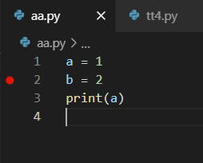
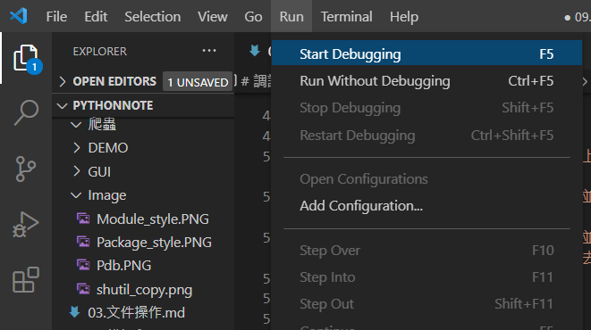
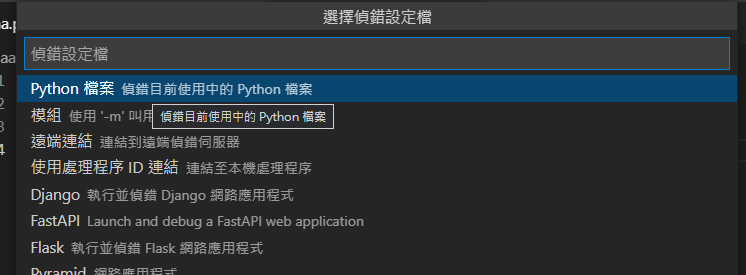
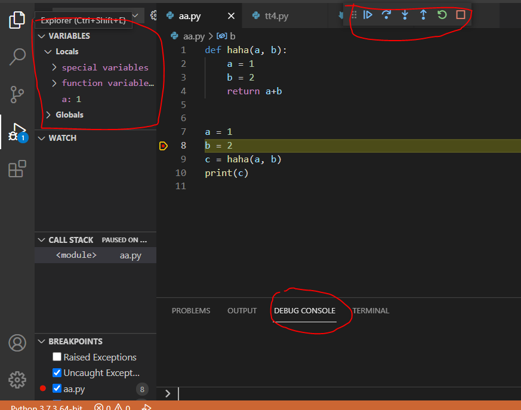

# 調試
---
+ ## 利用print
  + **利用print來查找錯誤，並調整程式**
  + ### 範例
    ```python
    def find_even(num_list):
        even_number = []
        for number in num_list:
            if number % 2 == 0:
                # 這邊增加一行print，看一下number是什麼東西，來檢視錯誤
                print(number)
                even_number.extend(number)
        return even_number


    a = [10, 1, 5]
    print(find_even(a))
    """
    print是蠻簡單好用的方法
    這題主要是list的方法extend只能放容器類的啦，要放單個對象類的要用append
    """
    ```
+ ## 利用pdb
  + **python內建的debug mode**
  + **該模式的圖片如下**
      
  + ### 範例
      ```python
      import pdb

      pdb.set_trace()


      def find_even(num_list):
          even_number = []
          for number in num_list:
              if number % 2 == 0:
                  even_number.extend([number])
          return even_number


      a = [10, 1, 5]

      print(find_even(a))
      """
      Pdb.set_trace為中斷點，設在不同地方就是在該處中斷
      會在terminal輸入指令
      ? : 查看有什麼指令可輸入
      l/list : 顯示正執行到的程式碼上下鄰近的幾行程式碼
      s/step : 只執行箭頭的程式碼，並跳往下一行，若碰到呼叫函式類的會跳進去
      n/next : 只執行箭頭的程式碼，並跳往下一行，若碰到呼叫函式類的不會跳進去
      p/print : 印出想印的變數
      exit : 退出
      """
      ```

+ ## 利用VS code debug mode
  + **直接利用VS code的工具來debug**
  + ### 範例
    1. **設置中斷點，在程式碼編號前面可以設置中斷點**
    
    2. **選擇Run裡面的Start Debugging或直接按F5**
    
    3. **選擇目前所使用的檔案**
    
    4. **進入debug mode**
    
        ```
        左邊區域有變數
        中上區域有debug工具
        中下區域有debug console
        ```
    5.**debug tool 介紹**
    + Continue(F5)是繼續執行直到碰到下一個中斷點或執行到結束
    + Step Over(F10)是執行該行程式後跳至下一行，如執行的是function也不會跳進去，如同pdb的next
    + Step Info(F11)是執行該行程式後跳至下一行，如執行的是function會跳進去，如同pdb的step
    + Step Out(shift+F11)是當前執行是在function裡面的話則會跳出去，若不在的話如同Continue
    + Restart(Ctrl+Shift+F5)重新執行
    + Stop(Shift+F5)中斷程式並跳出