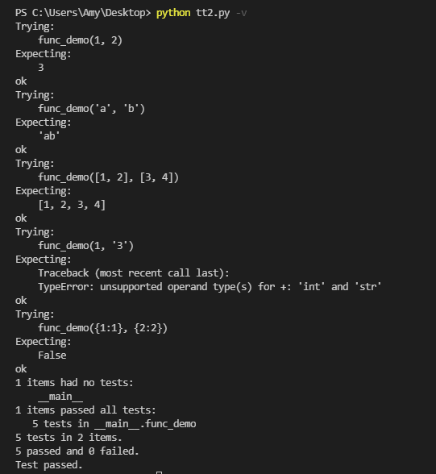

# 測試
---
+ ## 定義
  **在規定的條件下對程式進行操作，以發現程式錯誤，衡量軟體品質，並對其是否能滿足設計要求進行評估的過程**

+ ## 文檔測試(doc test)
  + ### 文檔指的是註釋掉的測試程式代碼
  + ### 文檔寫法是有執行的指令及結果
  + ### 當文檔裡的結果與執行結果不符合則會顯示錯誤訊息
  + ### 測試覆蓋率是指每一行執行程式中，共測試了幾行，如果每行都測試了，那程式覆蓋率就等於100%
  + ### 範例
    ```python
    ```

+ ## 單元測試(Unit Testing)
  + ### 定義:
    在電腦編程中，單元測試（英語：Unit Testing）又稱為模組測試，是針對程式模組（軟體設計的最小單位）來進行正確性檢驗的測試工作。程式單元是應用的最小可測試部件。在程序化編程中，一個單元就是單個程式、函式、過程等；對於物件導向程式設計，最小單元就是方法，包括基礎類別（超類）、抽象類、或者衍生類別（子類）中的方法。
  + ### 在python中最小單元基本上是函式及類別裡的方法
  + ### python單元測試的規範
    + 測試都是以`class`形式定義
    + 每個測試類別都必須是`unittest.TestCase`的子類別
    + 每個測試類別裡的測試方法都必須以`test_`開頭
    + 使用`assert`去檢查預期結果和實際結果是否相符
    + 在測試方法運行之前需要使用`setUp()`方法預先定義一些測試規範和臨時變量
    + 在測試方法執行完之後需要使用`tearDown()`方法清理和銷毀臨時變量等測試環境
    + 使用`python -m unittest -v test_module`執行測試
  + ### 範例
    ```python
    def func_demo(a, b):
        """
        >>> func_demo(1, 2)
        3
        >>> func_demo('a', 'b')
        'ab'
        >>> func_demo([1, 2], [3, 4])
        [1, 2, 3, 4]
        >>> func_demo(1, '3')
        Traceback (most recent call last):
        TypeError: unsupported operand type(s) for +: 'int' and 'str'
        >>> func_demo({1:1}, {2:2})
        False
        """
        if isinstance(a, dict):
            return False
        return a + b

    if __name__ == '__main__':
        import doctest
        doctest.testmod()    

    """
    如果輸入參數a不是字典的話，那isinstance(a, dict)裡面的程式就不會被測試到，測試覆蓋率也不會是100%
    要測試的指令要用註解包住
    寫法等同於在python底下直接輸入指令寫法，下面一行要緊跟著期望的結果
    執行的時候是原本的執行程式後面加個 -v
    例如:python tt.py -v
    資訊會顯示測試幾項，幾項成功，幾項失敗
    """
    ```
    
