# GUI
---

+ ## 定義
  **圖形使用者介面:採用圖形的方式讓使用者直接用圖形來操控程式運行**

+ ## 工具
  **TKinter:此為python內建的GUI製作工具，裡面有各種圖形控制元件可供使用**

+ ## 元件
  ### 1. 標籤 (Label)：顯示文本或圖像。
  ```python
  import tkinter as tk
  root = tk.Tk()
  label = tk.Label(root, text="Hello, World!")
  label.pack()
  root.mainloop()
  ```
  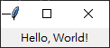

  ### 2. 按鈕 (Button)：用戶點擊時觸發事件。
  ```python
  import tkinter as tk
  root = tk.Tk()
  button = tk.Button(root, text="Click me!")
  button.pack()
  root.mainloop()
  ```
  

  ### 3. 文本框 (Entry)：用戶可以在其中輸入文本。
  ```python
  import tkinter as tk
  root = tk.Tk()
  entry = tk.Entry(root)
  entry.pack()
  root.mainloop()  
  ```
  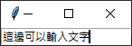 

  ### 4. 列表框 (Listbox)：顯示可選擇的項目列表。
  ```python
  import tkinter as tk
  root = tk.Tk()
  listbox = tk.Listbox(root)
  listbox.insert(1, 'item 1')
  listbox.insert(2, 'item 2')
  listbox.insert(3, 'item 3')
  listbox.pack()
  root.mainloop()  
  ```
  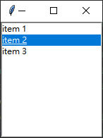

  ### 5. 滾動條 (Scrollbar)：可用於調整其他元件的值。
  ```python
  import tkinter as tk

  root = tk.Tk()
  root.geometry("200x200")

  # Create a Text widget
  text = tk.Text(root)

  # Create a Scrollbar and associate it with the Text widget
  scrollbar = tk.Scrollbar(root, command=text.yview)
  text.configure(yscrollcommand=scrollbar.set)

  # Pack the Scrollbar and Text widget
  scrollbar.pack(side=tk.RIGHT, fill=tk.Y)
  text.pack(fill=tk.BOTH, expand=True)

  root.mainloop()  
  ```
  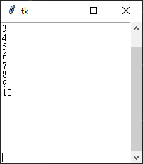

  ### 6. 選擇框 (Checkbutton)：用戶可以選擇或取消選擇。
  ```python
  import tkinter as tk

  root = tk.Tk()
  checkvar = tk.IntVar()
  checkbutton = tk.Checkbutton(root, text="Check me", variable=checkvar)
  checkbutton.pack()
  root.mainloop()
  ```
  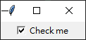

  ### 7. 單選按鈕 (Radiobutton)：用戶可以選擇一個選項。
  ```python
  import tkinter as tk

  root = tk.Tk()

  var = tk.StringVar()
  var.set("Option 1")
  for text in ["Option 1", "Option 2", "Option 3"]:
      radiobutton = tk.Radiobutton(root, text=text, variable=var, value=text)
      radiobutton.pack()

  root.mainloop()  
  ```
  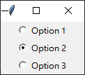

  ### 8. 文本區域 (Text)：用戶可以在其中輸入多行文本。
  ```python
  import tkinter as tk
  root = tk.Tk()
  text = tk.Text(root)
  text.pack()
  root.mainloop()
  ```
  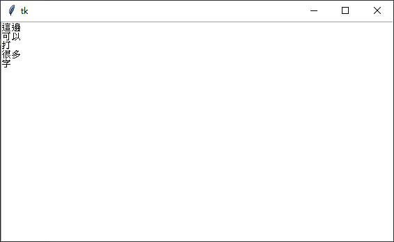

  ### 9. 簡單的下拉選單 (OptionMenu)：用戶可以從可選擇的項目列表中選擇一個選項。
  #### 它只需要傳遞一個主窗體和一個變數，然後可以通過使用 menu 屬性來設定下拉菜單中的選項
  ```python
  import tkinter as tk
  root = tk.Tk()
  var = tk.StringVar(root)
  var.set("Option 1")
  options = ["Option 1", "Option 2", "Option 3"]
  optionmenu = tk.OptionMenu(root, var, *options)
  optionmenu.pack()
  root.mainloop()  
  ```
  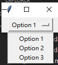

  ### 10. 高級的下拉選單(Combobox)：用戶可以從可選擇的項目列表中選擇一個選項。
  #### 它可以支援自動補全和編輯功能。使用時需要傳遞主窗體和一個變數，並且可以通過 values 屬性設定下拉菜單中的選項。
  ```python
  import tkinter as tk
  from tkinter import ttk

  root = tk.Tk()

  combo = tk.ttk.Combobox(root, values=["Option 1", "Option 2", "Option 3"])
  combo.pack()

  root.mainloop()  
  ```
  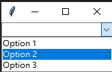  

  ### 11.圖標 (LabelFrame)：用於圍繞其他元件的框架。
  ```python
  import tkinter as tk
  root = tk.Tk()
  image = tk.PhotoImage(file="image.png")
  label = tk.Label(root, image=image)
  label.pack()
  root.mainloop()  
  ```
  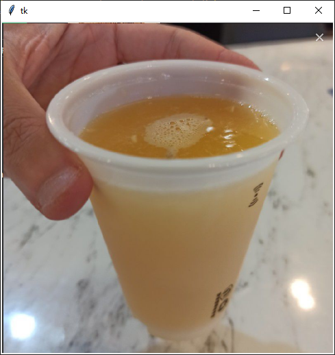

+ ## 佈局
  + ### 主要有3種，pack、place、grid
    ### 1. pack: 使用pack布局管理器可以將元件按照順序堆疊在容器中。
    ```python
    """
    其中順序有上、下、左、右，預設是由上至下堆疊
    side參數是用來決定從哪方向開始對齊的
    TOP: 由上至下
    BOTTOM: 由下至上
    LEFT: 由左至右
    RIGHT: 由右至左
    """
    import tkinter as tk

    root = tk.Tk()
    root.geometry("300x200")

    label1 = tk.Label(root, text="Label1")
    label1.pack(side=tk.TOP)

    label2 = tk.Label(root, text="Label2")
    label2.pack(side=tk.LEFT)

    label3 = tk.Label(root, text="Label3")
    label3.pack(side=tk.RIGHT)

    label4 = tk.Label(root, text="Label4")
    label4.pack(side=tk.RIGHT)

    root.mainloop()
    ```
    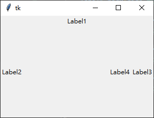

    ### 2. grid: 使用grid布局管理器可以將元件放置在網格中。
    ```python
    """
    它接受三個參數： row、column和sticky
    row和column就是元件所在的行列
    sticky參數指定了元件在網格中的對齊方式，可以是"n"、"s"、"e"、"w"、"ns"、"ne"、"nw"、"se"、"sw"和"nsew"
    制網格的大小：columnconfigure()和rowconfigure()
    columnconfigure(index, weight=weight) 可以設置欄的寬度比重，當容器大小改變時，欄寬將按比例改變。
    rowconfigure(index, weight=weight)可以設置行的高度比重，當容器大小改變時，行高將按比例改變。
    用rowspan來跨row
    用columnspan來跨column
    """

    import tkinter as tk 

    root = tk.Tk()

    label1 = tk.Label(root, text='帳號')
    label1.grid(row=0, column=0)
    label2 = tk.Label(root, text='密碼')
    label2.grid(row=1, column=0)


    Entry1 = tk.Entry(root)
    Entry1.grid(row=0, column=1)
    Entry2 = tk.Entry(root, show='*')
    Entry2.grid(row=1, column=1)

    # # 設定第0個row的高度為100
    # root.rowconfigure(0, minsize=100)

    # # 設定第0個row的寬度為200
    # root.columnconfigure(0, minsize=200)

    # 跨兩row

    image = tk.PhotoImage(file=r"C:\Users\Amy\Desktop\圖片 53.png")
    image = image.subsample(4, 4) # 是PhotoImage的一個方法，用來調整圖片尺寸，這邊是寬高都除以4
    PhotoImage = tk.Label(root, image=image)
    PhotoImage.grid(row=0, column=2, rowspan=3)


    root.mainloop()
    ```
    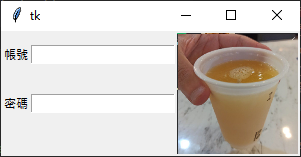

    ### 3. place: 使用place布局管理器可以使用絕對座標將元件放置在容器中。
    ```python
    """
    我最喜歡用的布局，直接給定x、y座標即可
    anchor：定義元件在窗口中的位置，可以是N, S, E, W, NE, NW, SE 或 SW
    左上為(0, 0)
    """

    import tkinter as tk

    root = tk.Tk()
    root.geometry("200x200")

    label = tk.Label(root, text="Hello World!", bg="red", fg="white")
    label.place(x=50, y=50, width=100, height=100, anchor="center")

    root.mainloop()
    ```

    **以下程式是為了幫助place找座標用的**
    ```python
    """
    主要是專門用來找座標的，以方便設定place布局
    就是把裡面這三個function以及兩個按鈕複製貼在想製作的GUI上，用來尋找想設定的位置
    注意: 想設定的位置不能有元件，不然座標會以元件為主，結果跟想要的會不一樣
    """

    import tkinter as tk

    root = tk.Tk()
    is_show_coord = False

    def on_button1_press():
        global is_show_coord
        if not is_show_coord:
            root.bind("<Motion>", on_mouse_motion)
            is_show_coord = True

    def on_button2_press():
        global is_show_coord
        if is_show_coord:
            root.unbind("<Motion>")
            is_show_coord = False

    def on_mouse_motion(event):
        x, y = event.x, event.y
        print("Mouse position: (%d, %d)" % (x, y))

    button1 = tk.Button(root, text="Show Coord", command=on_button1_press)
    button1.pack()

    button2 = tk.Button(root, text="Cancel", command=on_button2_press)
    button2.pack()

    root.mainloop()    
    ```
  + ### pack跟grid佈局會衝突
  + ### place佈局與其餘兩個佈局都能相容


+ ## 事件的觸發
  + ### command參數來觸發事件
    ```python
    """
    用commnad觸發事件的元件如下
    Button
    Checkbutton
    Menubutton
    Radiobutton
    """
    import tkinter as tk

    def radio_event():
        selection = radio_var.get()
        if selection == 1:
            print("Option 1 is selected")
        elif selection == 2:
            print("Option 2 is selected")
        else:
            print("Option 3 is selected")

    root = tk.Tk()
    root.title("Radiobutton Example")

    # Create a variable to store the selected value
    radio_var = tk.IntVar()

    # Create the radiobutton widgets
    # 其中，value是每個按鈕的值，而variable是會隨著使用者按不同按鈕而改變的
    rb1 = tk.Radiobutton(root, text="Option 1", variable=radio_var, value=1, command=radio_event)
    rb2 = tk.Radiobutton(root, text="Option 2", variable=radio_var, value=2, command=radio_event)
    rb3 = tk.Radiobutton(root, text="Option 3", variable=radio_var, value=3, command=radio_event)

    # Place the radiobutton widgets on the window
    rb1.pack()
    rb2.pack()
    rb3.pack()

    root.mainloop()    
    ```
    
  + ### 綁定事件的方法來觸發
    ```python
    """
    用綁定事件方法觸發的元件如下
    Entry
    Listbox
    Text
    Canvas
    Scale
    Scrollbar
    Spinbox
    """
    import tkinter as tk

    def on_entry_click(event):
        if entry.get() == "Enter text here":
            entry.delete(0, tk.END)
            entry.config(fg = 'black')


    root = tk.Tk()
    root.title("Entry Event Example")
    entry = tk.Entry(root, width=30, fg="grey")
    entry.insert(0, "Enter text here")
    entry.bind('<FocusIn>', on_entry_click)
    entry.pack()

    root.mainloop()

    """
    元件都有自己bind的字樣
    entry.bind的字樣
    "<FocusIn>"： 點擊Entry的事件
    "<FocusOut>"： 離開Entry的事件，但是我一直測試感覺沒啥用
    "<Return>"：按下 Enter 鍵的事件
    "<Tab>"：按下 Tab 鍵的事件
    "<BackSpace>"：按下 Backspace 鍵的事件
    "<Up>"：按下 Up 鍵的事件
    "<Down>"：按下 Down 鍵的事件

    listbox.bind的字樣
    "<Double-Button-1>"：連按兩下滑鼠左鍵時觸發，對應 Double-Click。
    "<Button-1>"：滑鼠左鍵點選時觸發。
    "<ButtonRelease-1>"：滑鼠左鍵釋放時觸發。
    "<Enter>"：滑鼠移動到 Listbox 元素上時觸發。
    "<Leave>"：滑鼠從 Listbox 元素上移動開時觸發。
    """    
    ```

+ ## 綁定使用的變數
  ```python
  """
  主要有三個tkinter.IntVar, tkinter.StringVar, tkinter.DoubleVar
  用途為
  1. 與tkinter的某些元件（例如：Checkbutton，Radiobutton，Spinbox）綁定，以實現一些選擇或輸入數值的功能。
  元件與變數的連結：使用 tk.StringVar() 和 tk.IntVar() 可以將元件的狀態（如輸入文字、選擇的選項等）與變數連結，方便在程式中進行讀取和操作。
  2. 能夠方便地獲取和修改這些元件的數值。
  元件狀態的同步：在元件與變數連結後，可以通過對變數的操作，來改變元件的狀態，也可以通過元件的操作，來影響變數的值。
  3. 可以將數值和變數綁定，方便程式中的使用。
  元件之間的數據共享：使用 tk.StringVar() 和 tk.IntVar() 可以方便的在元件之間共享數據，達到不同元件的狀態互相影響的效果。
  """
  import tkinter as tk

  root = tk.Tk()

  # 創建一個 StringVar 變數
  string_var = tk.StringVar()

  # 在 Entry 元件中使用 string_var
  entry = tk.Entry(root, textvariable=string_var)
  entry.pack()

  # 在變數 string_var 中設置文本內容
  string_var.set("Hello, Tkinter!")

  root.mainloop()  
  ```


+ ## 範例1. messagebox運用
    ```python
    import tkinter as tk
    from tkinter import messagebox

    win = tk.Tk()
    win.withdraw() # 隱藏根視窗

    messagebox.showinfo('title', 'content') # 顯示訊息對話框
    messagebox.showwarning('title', 'content') # 警告訊息對話框
    messagebox.showerror('title', 'content') # 錯誤訊息對話框
    messagebox.askokcancel('title', 'content') # 確定/取消訊息對話框
    messagebox.askquestion('title', 'content') # 是/否訊息對話框

    """
    判斷使用者選擇確定/取消/是/否，只要把結果丟進變數裡，判斷變數內容即可
    """
    ```

+ ## 範例2. 基本視窗元件參數設定
    ```python
    # GUI範例
    # 座標左上為(0,0)

    import tkinter as tk

    def change_label():
        new_label = en.get()    # 獲取輸入值
        lb.config(text=new_label)  # 修改其參數


    # 建立視窗
    win = tk.Tk()

    # 視窗標題
    win.title('視窗標題')

    # 視窗大小
    width = 800
    height = 600

    # 螢幕的解析度
    screen_width, screen_heigh = win.maxsize()
    center_width = (screen_width - width) // 2
    center_heigh = (screen_heigh - height) // 2

    # 視窗參數值設定
    win.geometry(f'{width}x{height}+{center_width}+{center_heigh}')

    # 關閉讓使用者手動改變視窗大小的功能
    win.resizable(width=False, height=False)

    # icon，一定要式ico檔
    win.iconbitmap(r"C:\Users\xx524\Desktop\IG.ico")

    # 背景顏色
    win.config(bg='#000000')

    # 透明度，1即不透明，0即全透明
    win.attributes('-alpha', 0.7)

    # 置頂
    win.attributes('-topmost', True)

    # 建立Label
    lb = tk.Label(text='影片路徑', bg='#000000', fg='#FFFFFF', font='微軟正黑體 18')
    lb.pack()
    # lbpath.grid(row=80, column=60)

    # 建立entry
    en_text = tk.StringVar()
    en_text.set('請輸入欲修改的label')
    en = tk.Entry(win, textvariable=en_text, font='微軟正黑體 18')
    en.pack()

    # 建立Button
    btn = tk.Button(text='button', command=change_label)
    btn.pack()

    # 常駐視窗
    win.mainloop()
    ```