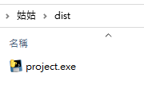

# 打包成exe
---

+ ## 主要是將程式打包成exe以方便別人執行
+ ## 使用的工具是pyinstaller
+ ## 安裝pyinstaller版本也要對應python的版本
    ```
    # 通常的PyInstaller安装方式
    pip install pyinstaller

    # 安装Python2.x的PyInstaller
    py -2 -m pip install pyinstaller
    # 安装Python3.9的PyInstaller
    py -3.9-64 -m pip install pyinstaller
    # 可用pyinstall help來確認版本    
    ```

+ ## 由於之前打包碰到不少問題，其實大多都是路徑上的問題，所以統整了一套結論
    ### 1. 在CMD底下執行
    ### 2. 切換至要打包的python路徑下
    ### 3. 指定好pyinstaller.exe的路徑
    ### 4. 打上-F -p
    ### 5. 指定好site-packagesk的路徑
    ### 6. 指定好envs環境路徑
    ### 7. 要打包的python檔名
    ```
    C:\Users\Amy\anaconda3\Scripts\pyinstaller.exe -F -p C:\Python39\Lib\site-packages;C:\Users\Amy\anaconda3\envs project.py    
    ```
+  ## 所以重點就是要知道上面這些路徑在哪裡，pyinstaller的路徑會根據每個人安裝的而不同，site-packages的路徑也就是你目前正在執行成功的python所用的套件路徑，envs路徑就是環境路徑，最後就是要打包的python的檔名
+  ## 打包好的exe順利的話會在dist資料夾下
     
