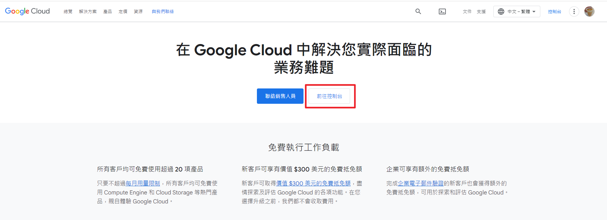
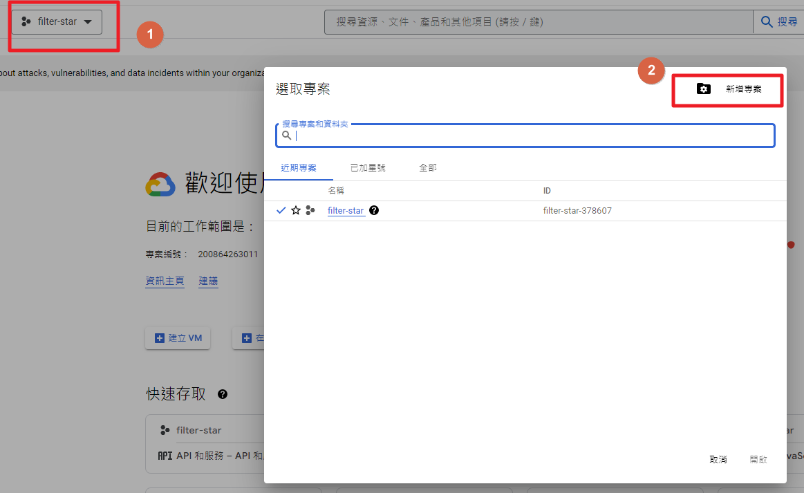
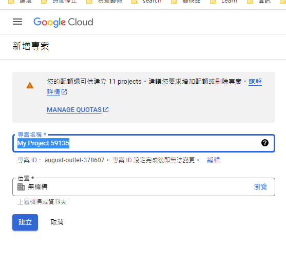
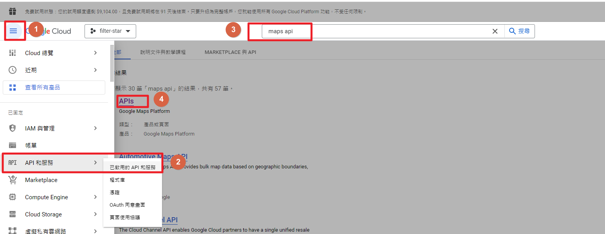
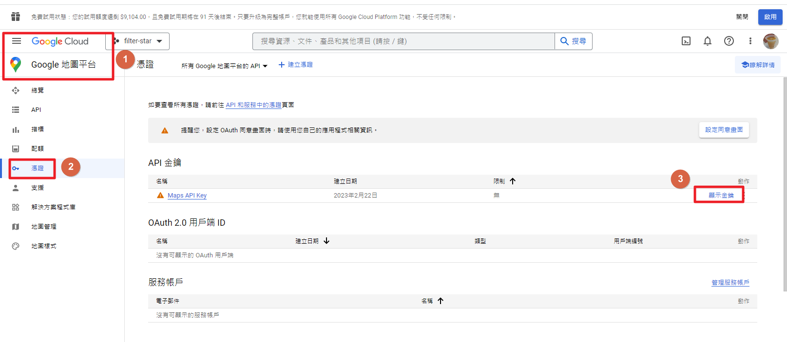
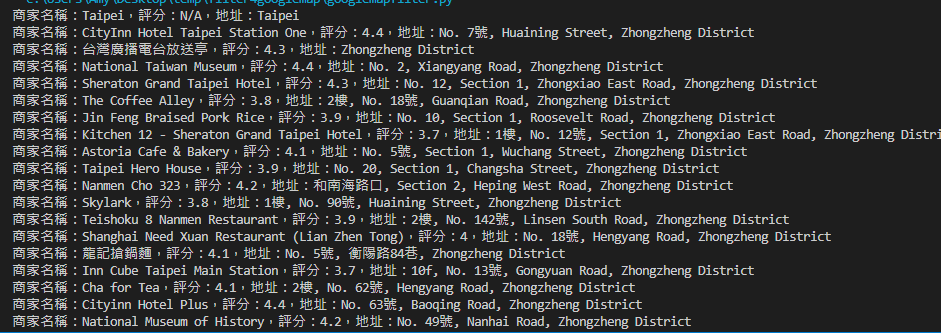

# google map api
---

+ ## 主要是想利用google map api做一個filter的功能，由於目前google map自己的評論並沒有辦法直接篩選出自己評過哪幾間是5星的，因此，才想說藉此做一個，然後順便玩一下api試試
+ ## 首先，要去Google Cloud Platform(GCP)，直接前往控制台
    
+ ## 新增一個專案
    
    
+ ## 啟動maps api服務(有可能原本就啟動了)
+ ## 注意:會需要填一些信用卡資料，因為本身會給免費使用次數的額度，超過額度就會扣款的
    
+ ## 就可以到google地圖平台拿到金鑰了
    
+ ## 接著，先簡單測試一下，用python串api看能不能拿到資料
    ```python
    # 要先pip install -U googlemaps

    import googlemaps

    api_key = 'YOUR_API_KEY'

    # 創建 Google Maps client
    gmaps = googlemaps.Client(api_key)

    # 檢索指定位置附近的商家
    places = gmaps.places_nearby(location='25.0381348,121.5175776', radius=1000)

    # 提取商家詳細信息
    for place in places['results']:
        name = place['name']
        rating = place.get('rating', 'N/A')
        address = place.get('vicinity', 'N/A')
        
        print(f'商家名稱：{name}，評分：{rating}，地址：{address}')  
    
    """
    YOUR_API_KEY當然就是要換成你的金鑰啦，然後location就是位置的緯度和經度坐標
    """  
    ```
+ ## 可以從中拿到資料如下
    

+ ## 再來測試如何拿到自己的評論資料
+ ## 經過不到一個下午的時間得到了結論，就是google map api所提供的資料僅是某個位置的周邊資訊，而得步道我的評論這種全面的資訊，所以，最多就是找尋某個點附近我評論的店家
+ ## 本來還想說用個定位來找的，但發現用api的定位不是很準，因為google map是透過瀏覽器的定位資訊，而api並不是，所以，精準度會有差，因此，我直接放棄用api定位的功能，只好自己先找附近的點，然後提供plus code，此為google發表的一套編碼，這個編碼方式是一種結合了經緯度和字母的編碼方式，可以用來描述地球上的任何一個位置，尤其對於那些沒有地址、無法透過常規方法進行定位的地點尤其有用，接著我會將其轉為經緯度，這樣就能去搜尋附近店家資訊了