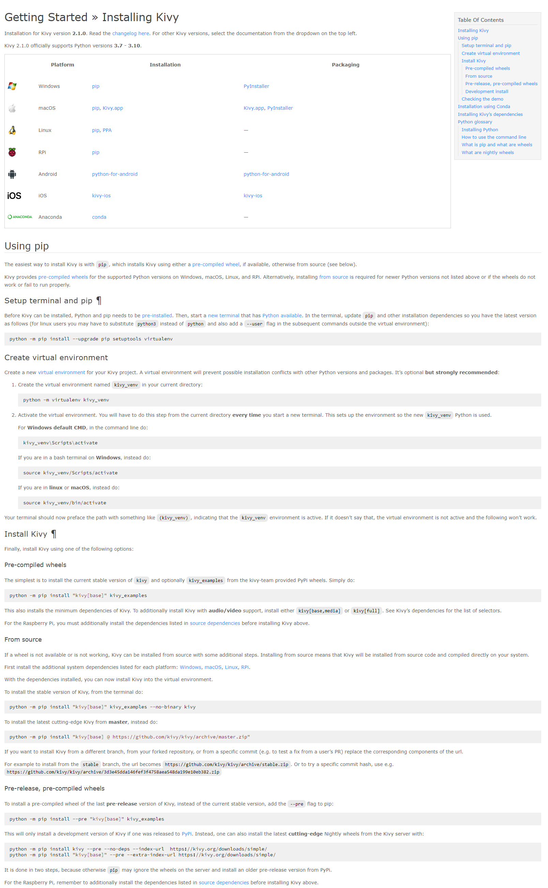
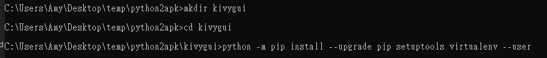
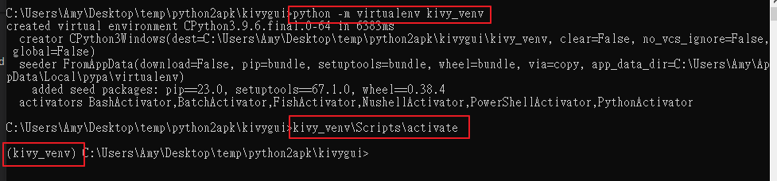
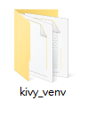
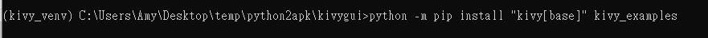
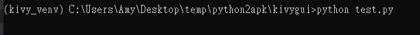
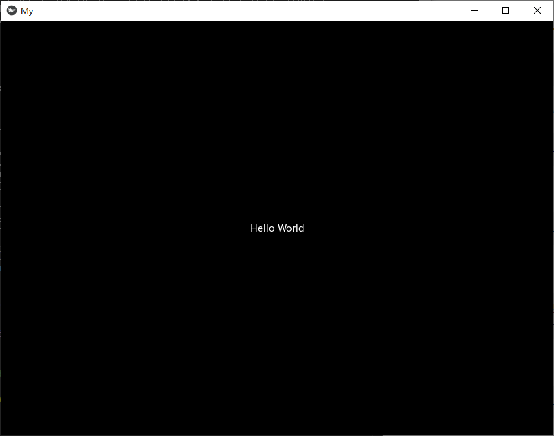

# python2apk
---


+ ## 主要是利用kivy這個框架，把python的程式包成apk，然後在手機上可以執行。
+ ## Kivy是一個Python庫，用於開發跨平台的應用程序，可以在Windows、MacOS、Linux、Android和iOS等不同平台上運行。
+ ##  建議要按照官方網站的順序操作，如下
  
  + ### Step1. Setup terminal and pip
    ```
    python -m pip install --upgrade pip setuptools virtualenv --user
    ```
  + ### Step2. Create virtual environment
    ```
    python -m virtualenv kivy_venv
    ```
    ### for cmd
    ```
    kivy_venv\Scripts\activate
    ```
    ### for bash
    ```
    source kivy_venv/Scripts/activate
    ```
  + ### Step3. Install Kivy
    ```
    ppython -m pip install "kivy[base]" kivy_examples
    ```
+ ## 白話文就是，要先創造一個虛擬環境供其使用，可以用cmd或者bash，我這邊用最常用的cmd來作範例
+ ## 範例
  + ### Step1. 設定cmd跟pip，我先創建一個名為kivygui的資料夾供其project使用，然後cmd切換到其資料夾底下，並輸入指令，其中的--user是用管理者的權限去安裝的，不然有些會說沒權限
    
  + ### Step2. 建議虛擬環境，這邊可以看到，創建虛擬環境後，會多個資料夾，然後進入該環境後，前面也會有kivy_venv的字樣
    
    
  + ### Step3. Install Kivy
    
  + ### Step4. 寫個python測試程式碼
    ```python
    import kivy
    kivy.require('1.11.1') # 指定用這版本的
    from kivy.app import App
    from kivy.uix.label import Label


    class MyApp(App): # 自定義的class，繼承app的屬性跟方法
        def build(self): # 重寫app中的build方法
            return Label(text='Hello World') # 創建一個label物件，內容為'Hello World'


    if __name__ == '__main__':
        MyApp().run() # 實例化MyApp物件並啟動程序    
    ```
  + ### Step5. 執行程式看效果
    
    

