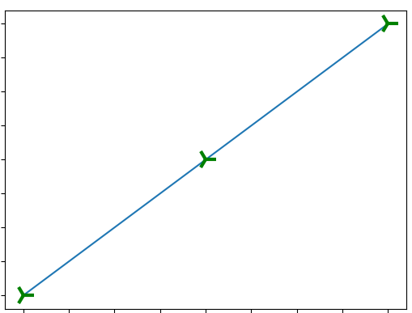
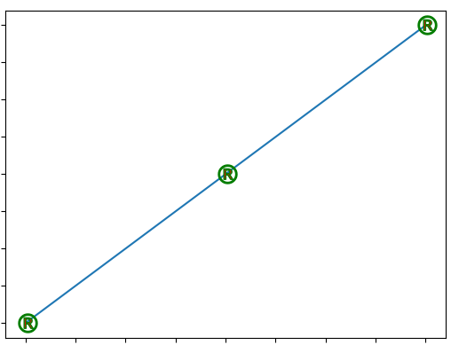
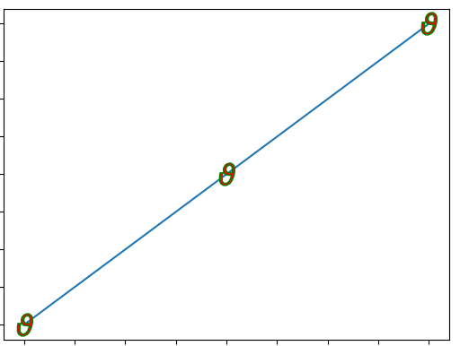
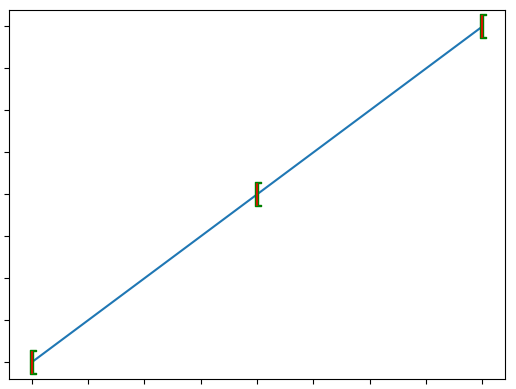

# Matplotlib
---

+ ## 數據可視化
+ ## Python 2D繪圖領域使用最廣泛的
+ ## 基本能取代Matlab的繪圖功能
+ ## 通過mplot3d可繪製精美的3D圖
+ ## 基礎畫圖
    ```python
    import numpy as np
    import matplotlib.pyplot as plt

    a, b = [1, 2, 3], [4, 5, 6]

    # 基本畫線
    # plt.plot(a, b)
    # plt.show()
    """
    plot: 生成一個plot對象，為2D的
    :x: x軸座標
    :y: y軸座標
    show: 顯示出來
    """


    # 線條相關
    # plt.plot(a, b, linestyle='--', linewidth=3.5, color='r')
    # plt.show()
    """
    :linestyle/ls: str，設定線條樣式，有指定的樣式，不能隨便亂給
    :linewidth/lw: float，設定線條寬度
    :color/c: str，設定線條顏色
    """

    # marker相關
    # plt.plot(a, b, marker='8', mec='r', mew=13, mfc='g')
    # plt.plot(a, b, marker='8', ms=18, mfc='r', mec='g')
    # plt.show()
    """
    :marker: str，設定標記樣式
    :markeredgecolor/mec: str，設定標記邊緣外框的顏色
    :markeredgewidth/mew: float，設定標記邊緣外框的寬度
    :markerfacecolor/mfc: str，設定標記中心的顏色
    :markersize/ms: float，設定標記大小
    注意:如果標記顏色沒特別設定的話，就是會跟著line的顏色走，所以，如沒特別設定mec或mfc，就會接跟著color參數走
    """

    # title、Label相關
    # plt.plot(a, b, label='Test')
    # plt.title('This is title', fontsize=18)
    # plt.xlabel('x label')
    # plt.ylabel('y軸', fontproperties="Microsoft JhengHei")
    # plt.legend()    # 將label顯示出來
    # plt.show()
    """
    title: 標題名稱
    xlabel: x軸的標籤
    ylabel: y軸的標籤
    legend: 搭配label的，將label顯示出來
    label: str，標籤名
    :fontsize: float，字型大小
    :fontproperties: str，字型設定
    注意: matplotlib預設是無法正常顯示中文字的，所以要用自行設定的參數來設定才能正常顯示中文字
    """

    # x軸、y軸顯示範圍
    # plt.plot(a, b)
    # plt.xlim(1.5, 2.5)
    # plt.ylim(4.5, 5.5)
    # plt.show()
    """
    xlim: 設定x軸的顯示範圍
    ylim: 設定y軸的顯示範圍
    """

    # 組合應用1
    # plt.plot(a, b, 'r8-.')
    # plt.show()
    """
    :fmt: 此參數是組合類型的參數，相當於[color][marker][linestyle]的組合體，此參數只能用位置參數傳遞，不可用關鍵字參數傳遞
    """

    # 增加數據
    # c, d = [10, 8, 6], [1, 8, 3]
    # plt.plot(a, b, '--', c, d, '*')
    # plt.show()
    """
    注意: 此方法只適用於位置來傳遞參數，不適用於關鍵字參數來傳遞
    """

    # 組合應用2
    # t = np.arange(0.0, 2.0, 0.1)
    # s = np.sin(t*np.pi)
    # plt.plot(t, s, 'r--', label='aaaa')
    # plt.plot(t*2, s, 'b--', label='bbbb')
    # plt.xlabel('This is x')
    # plt.ylabel('This is y')
    # plt.title('This is demo')
    # plt.legend()
    # plt.show()
    ```
+ ## 補充資料
  + ### 線條樣式
    |樣式|效果|
    |:-|:-
    |**-**|
    |**--**|
    |**-.**|
    |**:**|
  
  + ### 顏色    
    
    
    

  + ### 中文字型英文名
    |字型名|英文名|
    |:-|:-|
    |宋體|SimSun|
    |黑體|SimHei|
    |微軟雅黑|Microsoft YaHei|
    |微軟正黑體|Microsoft JhengHei|

  + ### 標記樣式
    |樣式|效果
    |:-|:-|
    |**.**|    
    |**o**|    
    |**v**|    
    |**^**|    
    |**<**|    
    |**>**|    
    |**1**|    
    |**2**|    
    |**3**|    
    |**4**|    
    |**8**|    
    |**s**|    
    |**p**|    
    |**P**|    
    |**\***|    
    |**h**|    
    |**H**|    
    |**+**|    
    |**x**|    
    |**X**|    
    |**d**|    
    |**D**|    
    |**|**|    
    |**_**|    
    |**\circledR**|    
    |**\\varpi**|    
    |**\\varrho**|    
    |**\\varsigma**|    
    |**\\vartheta**|    
    |**\\xi**|    
    |**\zeta**|    
    |**\Delta**|    
    |**\Gamma**|    
    |**\Lambda**|    
    |**\Omega**|    
    |**\Phi**|    
    |**\Pi**|    
    |**\Psi**|
    |**\Sigma**|
    |**\Theta**|
    |**\\Upsilon**|
    |**\Xi**|
    |**\mho**|
    |**\\nabla**|
    |**\\aleph**|
    |**\\beth**|
    |**\daleth**|
    |**\gimel**|
    |**\\Downarrow**|
    |**\\Uparrow**|
    |**\downarrow**|
    |**\\uparrow+**|
    |**\Vert**|
    |**\langle**|
    |**\lceil**|
    |**\lfloor**|
    |**\llcorner**|
    |**\lrcorner**|
    |**\\rangle**|
    |**\\rceil**|
    |**\\rfloor**|
    |**\\ulcorner**|
    |**\\urcorner**|
    |**\\vert**|
    |**\\bigcap**|
    |**\\bigcup**|
    |**\\bigodot**|
    |**\\bigoplus**|
    |**\\bigotimes**|
    |**\\biguplus**|
    |**\\bigvee**|
    |**\\bigwedge**|
    |**\int**|
    |**\oint**|
    |**\coprod**|
    |**\prod**|
    |**\sum**|
    |**/**|
    |**\\{**|
    |**\\}**|
    |**\[**|
    |**]**|