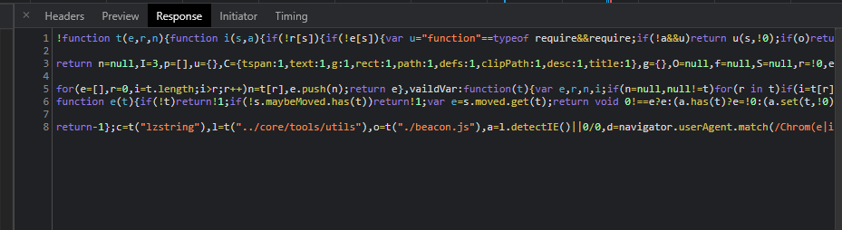

# 爬蟲基礎知識
---

+ ## Robots協議
    **robots.txt（統一小寫）是一種存放於網站根目錄下的ASCII編碼的文字檔案，它通常告訴網路搜尋引擎的漫遊器（又稱網路蜘蛛），此網站中的哪些內容是不應被搜尋引擎的漫遊器取得的，哪些是可以被漫遊器取得的。因為一些系統中的URL是大小寫敏感的，所以robots.txt的檔名應統一為小寫。**
    + ### 範例
       [google](https://www.google.com.tw/robots.txt)
       [百度](http://baidu.com/robots.txt)

+ ## 請求與響應
    **網路溝通的組成是Client與Server溝通的過程**
    1. 當我們瀏覽器輸入網址，等同客戶端向伺服器端發送請求(Request)去獲取該網址的HTML文件
    2. 伺服器會把Response文件發回給瀏覽器
    3. 瀏覽器解析Response中的HTML文件
    4. 若其中有引用別的文件，如Image文件、CSS文件、JS文件...等，瀏覽器會再次發送請求給伺服器端以獲取對應的文件
    5. 所有的文件都成功請求到之後，網頁會根據HTML語法結構，完整顯示出來

+ ## Chrome開發者工具
    **超常用的工具沒有之一**
    1. ### 元素面板(Elements)
        **通過元素面板，能查看頁面渲染內容所在的標籤、CSS屬性...等屬性**
    

    2. ### 控制台(Console)
        **是用於顯示JS和DOM物件訊息的視窗**
        **主要是用來調試運行JS程式碼**
    

    3. ### 資源面板(Sources)
        **可察看當前網頁的原始文件(source file)**
        **左側為原始文件，以樹狀結構方式顯示**
        **中側為可調試JS代碼的區域**
        **右側為斷點調試功能區域**
    

    4. ### 網路面板(Network)
        **很常用的功能**
        **該面板記錄著每個網路操作的相關訊息**
        **包括詳細的耗時數據、HTTP請求及響應標頭、Cookie...等**
        
       + 工具欄
       + Stop recoding network log
        **停止/開啟 記錄所有的網路請求**
        **預設為開啟，紅色為開啟，灰色為關閉**
        
        
       + Clear
           **清空所有的數據**
        
       + Filter
           **數據過濾器**
           **藍色為開啟、灰色為關閉**
        
        
         + Requests Table
            **此表格會列出向伺服器索取的每一個HTTP請求，默認情況是按時間排序**
            
         + all(所有請求數據)
         + XHR(XML HttpRequest的縮寫，是ajax技術的核心，動態加載完成經常分析的一個內容)
         + CSS(css樣式的文件)
         + JS(JavaScript文件，js解密是經常分析的頁面)
         + Img(圖片文件)
         + Font(字體文件)
         + DOC(Document，文檔內容)
         + WS(WebSocket,web端的Socket數據通信，一般用於一些實時更新的數據)
         + Manifest(顯示通過Manifest緩存的資源，包含很多信息，如js資料文件會顯示文件地址、大小、類型)
       + Search
          **搜尋欄，只要在all裡面出現過的內容，就可以被直接搜索到**
       + Preserve log
        **保留日誌，做爬蟲一定要勾選上**
       + Disable cache
        **清空Javascript、CSS文件暫存，獲取最新的**
       + Hide data URLs
        **用於是否隱藏dataurl，Data URL技術是圖片數據以base64字串格式嵌入到頁面中和HTML融為一體**

    5. ### Requests詳情
    
       + #### Headers
         **顯示HTTP請求的標頭檔**
         1. General
            1. Request url:實際請求的網址
            2. Request Method:請求的方法
            3. Status code:狀態碼
           
         2. Response Headers
             **伺服器返回時設置的一些數據，例如:伺服器更新的cookieg數據為新是在這裡出現修改**
           
         3. Requests Headers
             **請求標頭檔，請求不到數據的原因一般出現在這裡**
            1. Accept:伺服器接收的數據格式(一般忽略)
            2. Accept-Encoding:伺服器接收的編碼格式(一般忽略)
            3. Accept-Language:伺服器接收的語言(一般忽略)
            4. Connection:保持連接(一般忽略)
            5. Cookies:是身分訊息，爬取VIP資源是需要此訊息的
            6. Host:請求的主機位址
            7. User-Agent:用戶身分代理，伺服器用此訊息判斷用戶
            8. Sec-xxx-xxx:其他訊息
           

    6. ### Preview
        **請求結果的預覽，一般用來查看請求到的圖片**
      
    7. ### Response
        **請求返回的結果，一般的內容是整個網站的源代碼，如果是非同步請求，返回的結果一般是Json文本數據**
        **此數據與瀏覽器顯示的網頁可能不一致，因為瀏覽器是動態加載的**
      

+ ## 爬蟲思路
  1. 欲爬取資料的網站網址(url)
     1. 靜態網頁:直接是網址欄內的網址
     2. 動態網頁:通過開發者工具抓包
  2. 請求url的數據
     1. 文本數據
     2. js數據
     3. css數據
     4. 圖片數據
     5. 影片數據
     6. etc
  3. 數據解析，解析出自己想要的數據
     1. css選擇器
     2. 正則表達式
     3. Xpath節點提取
  4. 數據保存
     1. 本機
     2. 資料庫
        1. redis
        2. MongoDB
     3. 雲端

+ ## HTTP/HTTPS
  + HTTP(HyperText Transfer Protocol)超文本傳輸協定:是一個客戶端（使用者）和伺服器端（網站）之間請求和應答的標準，通常使用TCP協定。HTTP是全球資訊網的數據通信的基礎。**
  + HTTPS(HyperText Transfer Protocol Secure)超文本傳輸安全協定:簡單的來說就是HTTP的安全版，在HTTP下加入SSL層
  + HTTP的缺點:
    1. 通信是用明文(不加密)，內容可能被竊聽
    2. 不會驗證通信方的身分，有可能遭遇偽裝
    3. 無法證明資訊的完整性，有可能遭到竄改
  + HTTPS的優點:
    解決上述問題，在HTTP層以下加入SSL或TSL層，主要用途為對連接的訊息加密
    

+ ## URL
  + URL(Uniform Resource Locator)統一資源定位符:俗稱:網址，是網際網路上標準的資源的位址。
  + 統一資源定位符的`標準`格式如下：
  ```
  [協定類型]://[伺服器位址]:[埠號]/[資源層級UNIX檔案路徑][檔名]?[查詢]#[片段ID]
  ```
  + 統一資源定位符的`完整`格式如下：
  ```
  [協定類型]://[存取資源需要的憑證資訊]@[伺服器位址]:[埠號]/[資源層級UNIX檔案路徑][檔名]?[查詢]#[片段ID]
  ```
  PS:其中[存取憑證資訊]、[埠號]、[查詢]、[片段ID]都屬於選填項。
  + 範例:
    ```
    https://zh.wikipedia.org:443/w/index.php?title=隨機頁面
    ```
    1. https:協定類型
    2. zh.wikipedia.org:伺服器位址
    3. 443:埠號
    4. /w/index.php:資源層級UNIX檔案路徑
    5. ?title=隨機頁面:查詢

+ ## Request(請求資訊)
  + ### 組成
  **由以下4個組成**
    1. 請求行
    2. 請求頭
    3. 空行
    4. 其他請求數據
    **注意:這是HTTP下的協議，與chrome上看到的Headers的資訊會有所差異**
    
  + ### 請求方法
    1. GET(極度常用):向指定的資源發出「顯示」請求。使用GET方法應該只用在讀取資料，而不應當被用於產生「副作用」的操作中，例如在網路應用程式中。其中一個原因是GET可能會被網路爬蟲等隨意存取。參見安全方法。瀏覽器直接發出的GET只能由一個url觸發。GET上要在url之外帶一些參數就只能依靠url上附帶querystring。
    2. POST(常用):向指定資源提交資料，請求伺服器進行處理（例如提交表單或者上傳檔案）。資料被包含在請求本文中。這個請求可能會建立新的資源或修改現有資源，或二者皆有。每次提交，表單的資料被瀏覽器用編碼到HTTP請求的body里。瀏覽器發出的POST請求的body主要有兩種格式，一種是application/x-www-form-urlencoded用來傳輸簡單的資料，大概就是"key1=value1&key2=value2"這樣的格式。另外一種是傳檔案，會採用multipart/form-data格式。採用後者是因為application/x-www-form-urlencoded的編碼方式對於檔案這種二進位的資料非常低效。
    3. HEAD:與GET方法一樣，都是向伺服器發出指定資源的請求。只不過伺服器將不傳回資源的本文部份。它的好處在於，使用這個方法可以在不必傳輸全部內容的情況下，就可以取得其中「關於該資源的訊息」（元訊息或稱元資料）。
    4. PUT:向指定資源位置上傳其最新內容。
    5. DELETE:請求伺服器刪除Request-URI所標識的資源。
    6. TRACE:回顯伺服器收到的請求，主要用於測試或診斷。
    7. OPTIONS:這個方法可使伺服器傳回該資源所支援的所有HTTP請求方法。用'*'來代替資源名稱，向Web伺服器傳送OPTIONS請求，可以測試伺服器功能是否正常運作。
    8. CONNECT:HTTP/1.1協定中預留給能夠將連接改為隧道方式的代理伺服器。通常用於SSL加密伺服器的連結（經由非加密的HTTP代理伺服器）。
        
