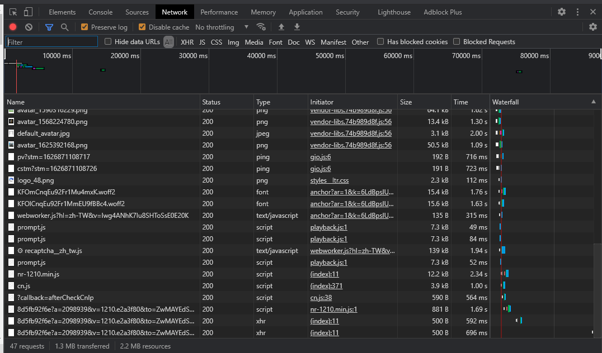

# 通用爬蟲
---

+ ## Robots協議
    **robots.txt（統一小寫）是一種存放於網站根目錄下的ASCII編碼的文字檔案，它通常告訴網路搜尋引擎的漫遊器（又稱網路蜘蛛），此網站中的哪些內容是不應被搜尋引擎的漫遊器取得的，哪些是可以被漫遊器取得的。因為一些系統中的URL是大小寫敏感的，所以robots.txt的檔名應統一為小寫。**
    + ### 範例
       [google](https://www.google.com.tw/robots.txt)
       [百度](http://baidu.com/robots.txt)

+ ## 請求與響應
    **網路溝通的組成是Client與Server溝通的過程**
    1. 當我們瀏覽器輸入網址，等同客戶端向伺服器端發送請求(Request)去獲取該網址的HTML文件
    2. 伺服器會把Response文件發回給瀏覽器
    3. 瀏覽器解析Response中的HTML文件
    4. 若其中有引用別的文件，如Image文件、CSS文件、JS文件...等，瀏覽器會再次發送請求給伺服器端以獲取對應的文件
    5. 所有的文件都成功請求到之後，網頁會根據HTML語法結構，完整顯示出來

+ ## Chrome開發者工具
    **超常用的工具沒有之一**
    1. ### 元素面板(Elements)
        **通過元素面板，能查看頁面渲染內容所在的標籤、CSS屬性...等屬性**
    
    2. ### 控制台(Console)
        **是用於顯示JS和DOM物件訊息的視窗**
        **主要是用來調試運行JS程式碼**
    
    3. ### 資源面板(Sources)
        **可察看當前網頁的原始文件(source file)**
        **左側為原始文件，以樹狀結構方式顯示**
        **中側為可調試JS代碼的區域**
        **右側為斷點調試功能區域**
    
    4. ### 網路面板(Network)
        **很常用的功能**
        **該面板記錄著每個網路操作的相關訊息**
        **包括詳細的耗時數據、HTTP請求及響應標頭、Cookie...等**
    
        + 工具欄
          + Stop recoding network log
            **停止/開啟 記錄所有的網路請求**
            **預設為開啟，紅色為開啟，灰色為關閉**
            
            
          + Clear
            **清空所有的數據**
            
          + Filter
            **數據過濾器**
            **藍色為開啟、灰色為關閉**
            
            
            + 

        
